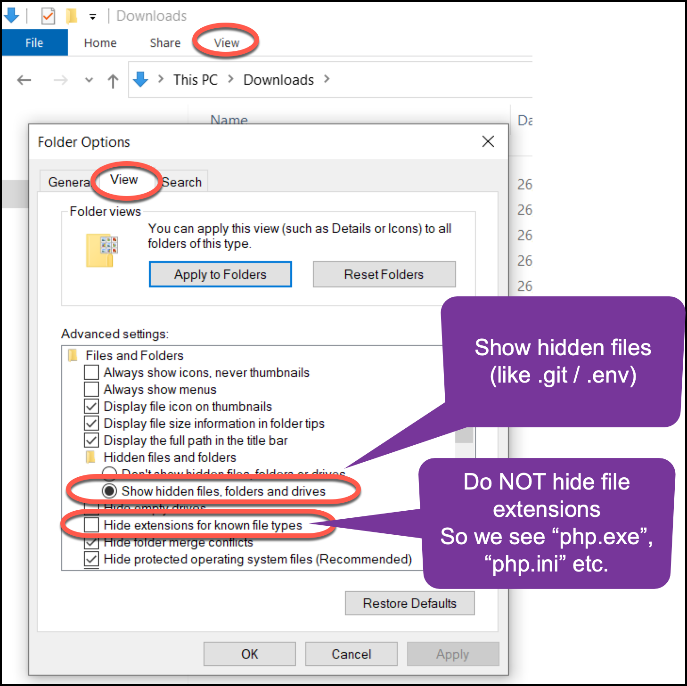
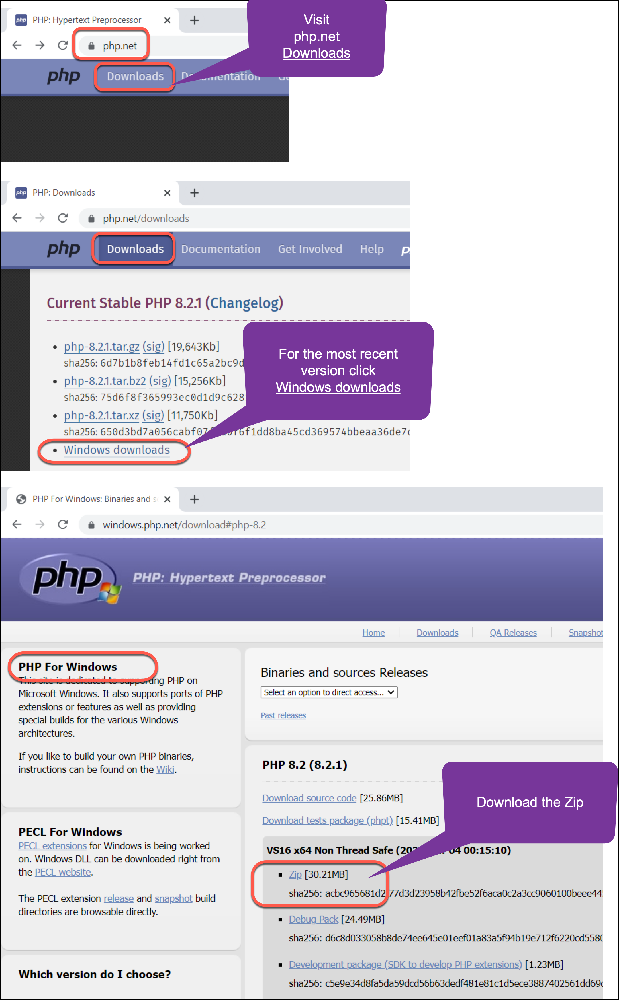
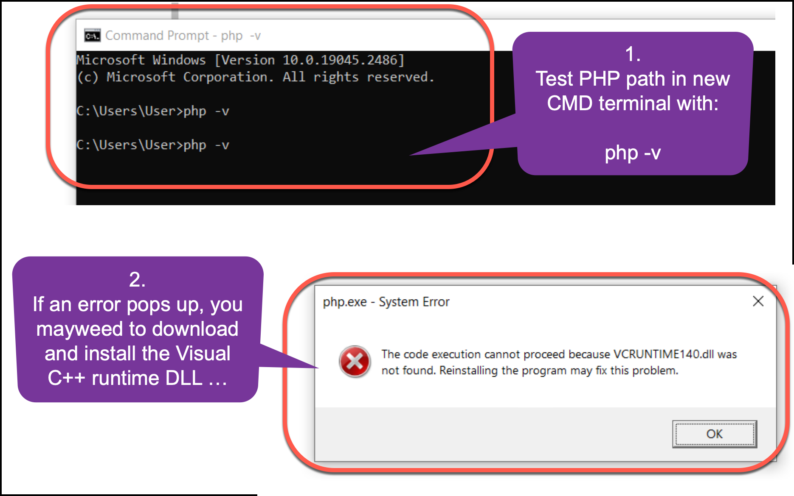
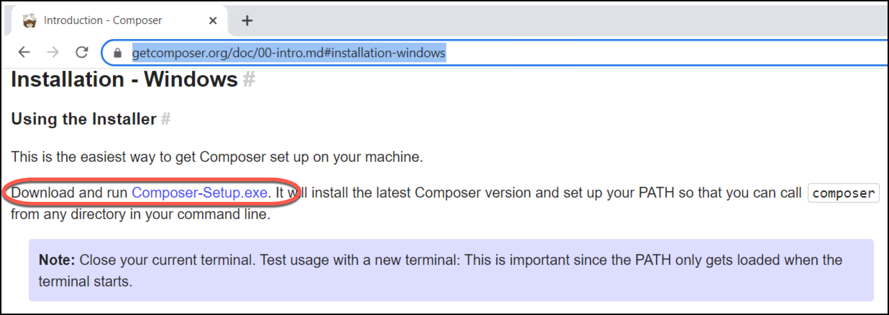
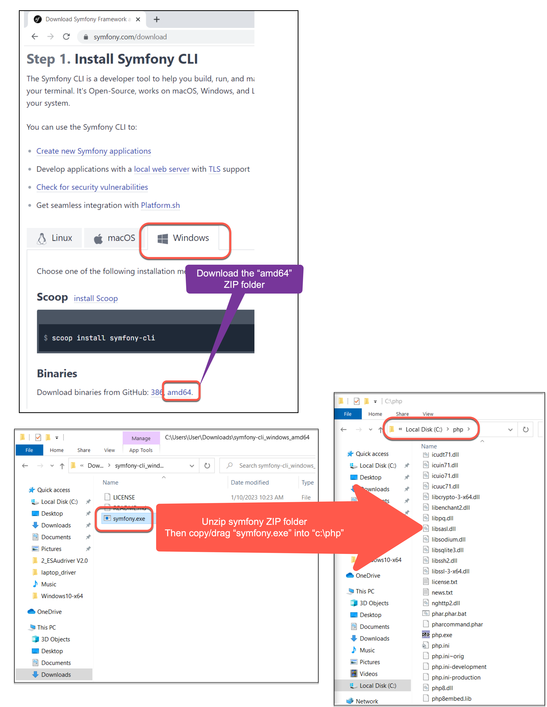

# 2023-php-setup-windows

Here the notes I made when setting up PHP, Composer and the Symfony tools on my Windows 10 laptop in January 2023

## Step 1 - ensure user has full access

Your Windows user should:

- have full administrator rights
- be able see all file extensions, and all hidden files (make this your DEFAULT view settings in the Windows Explorer)

## Step 2 - download ZIP from php.net Windows downlaods

Visit php.net:

- find Downloads page
- find Windows downloads for latest version of PHP
- download the ZIP
- 

## Step 3 - extract ZIP into `C:\php`

Your Windows user should:

- have full administrator rights
- be able see all file extensions, and all hidden files (make this your DEFAULT view settings in the Windows Explorer)

## Step 4 - enable the DB and several useful extension

We need to create then edit settings file `C:\php\php.ini`

- copy "php.ini-development", naming the copy "php.ini"
- edit "php.ini" in a text editor like Notepad or Notepad++
- search for "extensions=curl"
- enable these 5 extensions (remove the semi-colon at the begining of the lines)
  - curl
  - openssl
  - pdo_mysql
  - pdo_sqlite
  - zip

## Step 5 - enable the DB and several useful extension

Add folder `C:\php` to the System "Path" Environment Variable

## Step 6 - (may not be necessary) install VC runtime if error pops up

Test your PHP installation as follows:

- open a new CMD terminal
- type: `php -v`
- if you just see the PHP version message appear, all is good

however, if (as happened on one of my laptops, with new Windows 10 install) a "php.eve - System Error" dialog popups, then you may need to install a Visual C++ runtime DLL library. Download latest compatible version (usually the 64 version) from here
- [https://learn.microsoft.com/en-US/cpp/windows/latest-supported-vc-redist?view=msvc-170](https://learn.microsoft.com/en-US/cpp/windows/latest-supported-vc-redist?view=msvc-170)

## Step 7 - install Composer command line tool

Download and run the Composer installer from here:

- [https://getcomposer.org/doc/00-intro.md#installation-windows](https://getcomposer.org/doc/00-intro.md#installation-windows)

Accept all the defaults - it should just work.

- test the Composer installation by running a new CMD terminal window and typing "composer"

## Step 8 - download Symfony command line application and copy to `C:\php`

Download the Symfony command line tool from here ("amd64")

- [https://symfony.com/download](https://symfony.com/download)

Unzip the downloaded folder, and copy file "symfony.exe" into  `C:\php`

That's it! Since this folder is already in our "Path" environment variable, this executable should be found when we type "symfony" at the command line. 

- test the Symfony tool installation by running a new CMD terminal window and typing "symfony"

